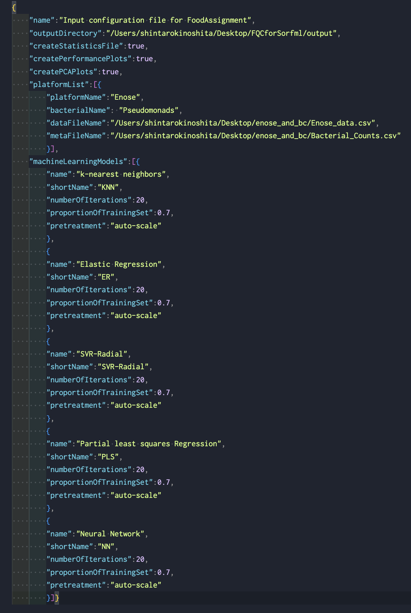
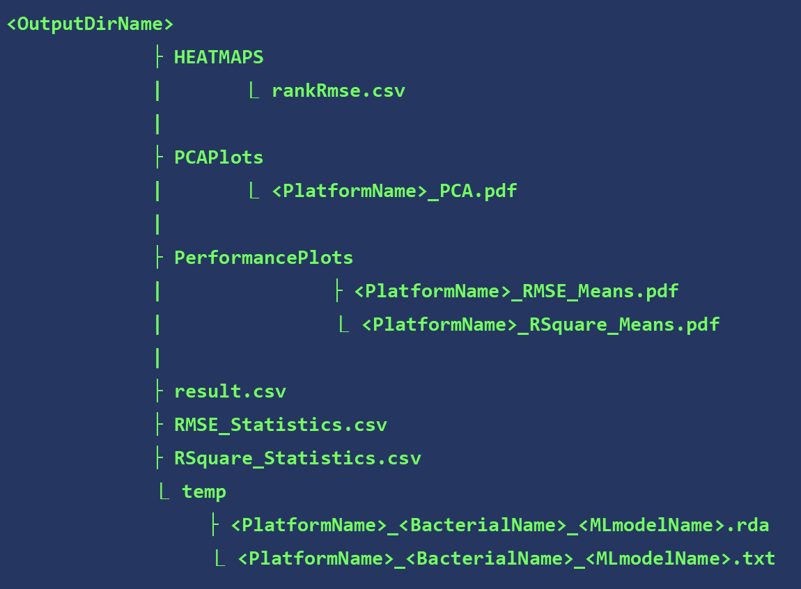

# Summary


This is modified version of the [FoodQualityController R package](https://github.com/ozlemkaradeniz/FoodQualityController) which is optimised for the back-end side of sorfML 2.0. FQC is a flexible and user-friendly R package that is used to identify, validate, and optimise the most suitable machine learning platform for the given analytical platform. 14 machine learning models are created in the package to predict microbial quality in food products.

# Table of Contents

-   [Summary](#summary)
-   [FoodQualityController workflow](#foodQualityController-workflow)
-   [Installation](#installation)
    -   [Dependencies](#dependencies)
    -   [Install FoodQualityController from source](#install-foodQualityController-from-source)
-   [Quick Start](#quick-start)
    -   [Load FoodQualityController](#load-foodQualityController)
    -   [Reading application parameters from configuration file](#reading-application-parameters-from-configuration-file)
    -   [Reading data from input files](#reading-data-from-input-files)
    -   [Creating output files](#creating-output-files)
-   [Acessing help](#accessing-help)
-   [Questions, bug reports or issues](#questions-bug-reports-or-issues)

# FoodQualityController workflow

The typical workflow of FoodQualityController is outlined below: 

# Installation

## Dependencies

FoodQualityController needs the following:

-   **R** (tested on version 4.2.2)
-   **The following R libraries:** (The number is the version tested during development)

<!-- -->

       caret (6.0.91)             neuralnet (1.44.2)
       colorRamps (2.3.1)         openxlsx (4.2.5)
       Boruta (7.0.0)             pls (2.8.0)
       configr (0.3.5)            plyr (1.8.7) 
       corrplot (0.92)            randomForest (4.7.1) 
       doParallel (1.0.17)        rpart (4.1.16)
       e1071 (1.7.9)              shape (1.4.6)
       foreach (1.5.2)            tools (4.1.1)
       glmnet (4.1.3)             viridis (0.6.2)
       mixOmics (6.16.3)          xgboost (1.5.2.1)
       

**Note:** The package is platform-independent; it was developed and runs on multiple operating systems (Windows, MacOS).

All dependencies should be installed together with the FoodQualityController package, however, they can be installed separately. To install all required CRAN dependencies of FoodQualityController, type the following in R:

```{r}
> install.packages(c("caret", "colorRamps", "Boruta", "corrplot", "doParallel", "e1071", "foreach", "glmnet", "mixOmics", "neuralnet" ,
"openxlsx", "pls", "plyr", "randomForest", "rpart", "shape", "tools", "viridis", "xgboost"))
```

## Install FoodQualityController from source

You can download the latest source from the [FQCforSorfml GitHub repository page](https://github.com/shin-kinos/FQCforSorfml).

An example installation of FQC onto your environment using `git` command.

Type the command below in your terminal:

```
% git clone https://github.com/shin-kinos/FQCforSorfml.git
```

Then, go to R consosle, and install the source package:

```{r}
> library(utils)
> install.packages("FQCforSorfml", repos = NULL, type = "source", dependencies=TRUE)
```

# Quick Start

## Load FoodQualityController

Once the package is installed, to start using FoodQualityController simply load the FoodQualityController package in R:

```{r}
> library(FoodQualityController)
```

## Reading application parameters from configuration file

FoodQualityController can read configuration file in json format. 
assess.quality which is the main function of FoodQualityController takes name of the configuration file as parameter.
Configuration file contains user-defined parameters which are required by the application.

Example of a input files is as following:

 


## Reading data from input files

Input datafiles from different analytical platforms contain microbial data on which machine learning models run.
Name of the datafiles with absolute directory path should be provided with dataFileName tag under
platformList tag in the configuration file, for more details see in 'Input configuration file format' section.

## How to run FoodQualityController

The main and only function that is exported to the user in FoodQualityController package is assess.quality.

It is called as following with configuration file name as method parameter.

```{r}
> assess.quality("/Users/shintarokinoshita/Cranfield/FoodQualityController/input/config.json")
```

## Creating output files

Output directory is provided in outputDirectory section of configuration file by the user. If it is not provided, the output directory becomes the current working directory. 

The general structure of the output directory and files are below:

 

-   `rankRmse.csv` : List of ML models which are sorted based on the RMSEs. ✅Note that the format of this data are optimised for LaTeX document preparation.
-   `<PlatformName>_PCA.pdf` : PCA plot of analytical data.
-   `<PlatformName>_RMSE_Means.pdf` : Line plot of the RMSE scores in each iteration between the ML models.
-    `<PlatformName>_RSquare_Means.pdf` : Line plot of the RSquare scores in each iteration between the ML models.
-    `result.csv` : CSV data recording results of the evaluation Statistics in each ML model.
-    `RSME_Statistics.csv` : CSV data recording RMSEs in each model.
-    `RSquare_Statistics.csv` : CSV data recording RSquares in each model.
-    `<PlatformName>_<BacterialName>_<MLmodelName>.rda` : RDA data containing the model information which aqcuired the lowest RMSE throughout the iterations.
-    `<PlatformName>_<BacterialName>_<MLmodelName>.txt` : Text data containing the lowest RMSE in the ML model.

# Accessing help

To access help pages for any of the functions or built-in data provided by FoodQualityController, prefix the name of the function or data set with a question mark, e.g. to get additional information on the `assess.quality` function, type the following in R:

```{r}
?assess.quality
```
**For the moment, the PLS, NN and RT (for the latest only for "no-pretreatment" and "mean-center" scaling) machine learning algorithms are not working**
